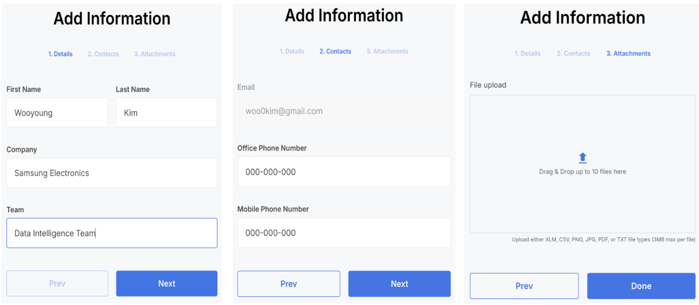
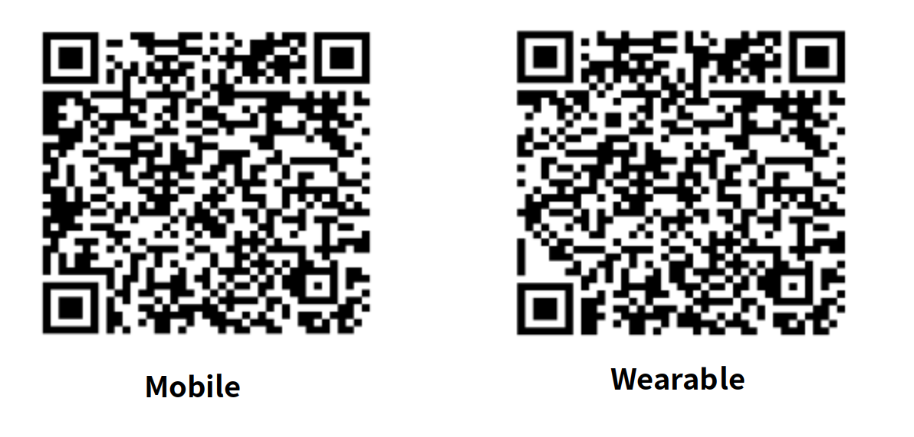

# Samsung Health Research Stack Playground

## Contents
- [Introduction](#introduction)
  - [1. Objective](#1-objective)
  - [2. Overview](#2-overview)
- [Start With DefaultStudy](#start-with-defaultstudy)
  - [1. Sign In](#1-sign-in-with-your-google-account)
  - [2. Register Profile](#2-register-as-an-investigator-on-the-web)
  - [3. Get into DefaultStudy](#3-get-into-default-study)
  - [4. Download Apk](#4-download-apk)
  - [5. Setup Mobile Starter App](#5-setup-mobile-starter-app)
  - [6. Setup Watch Starter App](#6-setup-watch-starter-app)
  - [7. Collect Health Data](#7-collect-health-data)
  - [8. Check Health Data on the portal](#8-check-health-data-on-the-portal)

# Introduction

## 1. Objective
Samsung Health Research Stack Playground lets you easily experience Health Research Stack without complex user side setting. In Samsung Health Research Stack Playground, Researchers don't have to setup all Health Research Stack components. All Researchers need to do is just installing application on their devices. By installing application into their devices, Researchers can access to our core features and it will be a great help in deciding whether to use Health Research Stack or not.

## 2. Overview
Samsung Health Research Stack Playground is a project that helps you easily experience Health Research Stack's core features.

[Samsung Health Research Stack](https://developer.samsung.com/health/stack) includes:
  * Backend: API endpoints allow you to access and interact with a robust data engine
  * Web Portal: customizable interface for creating surveys, managing team members, tracking subjects, and analyzing data.
  * App SDK: A Software Development Kit for building Android and Wear OS apps capable of collecting data from wearable devices.
  * Starter App: A health research app created using basic features provided by the App SDK to help users with a soft landing. There are mobile and wearable versions.

In [Samsung Research Stack Playground](https://portal.s-researchstack.io/signin), Samsung manage all software infrastructure, Backend and Web Portal.
You can easily get into Health Research Stack's core features by building your app using App SDK or just installing our Starter App. 

# Start With Default Study

This section is intended for users who want to explore the Health Research Stack Playground without any additional setups required. Here, users won't need to build their own application or create Study. By simply registering your profile using their Google account, they will automatically be enrolled in the default study.

## 1. [Sign In](https://portal.s-researchstack.io/signin) with your Google Account.

## 2. Register as an investigator on the web.

## 3. Get into Default Study

By registering your account, you will automatically be enrolled in the Default Study, allowing you to dive right in.

## 4. Download Apk

## [If your devices have been set up already, click me.](#7-collect-health-data)

We offer two ways to download mobile apk and wearable apk.

### A. Download Apk from Portal

By clicking download button, investigators can download Apk from left sidebar on the portal

### B. Download Apk by scanning QR codes

## 5. Setup Mobile Starter App

### Prerequisite
  * Prepare a Samsung Device
    * Install or update the Health Connect app and Samsung Health app from the Google Play Store (No Health Connect installation required after Android 14)
      * [Samsung Health app](https://play.google.com/store/apps/details?id=com.sec.android.app.shealth&hl=en_US) 
      * [Health Connect app](https://play.google.com/store/apps/details?id=com.google.android.apps.healthdata&hl=en_US)
    * Connect your Samsung device using USB cable to your PC
  * Install Samsung Health Research Stack Mobile Apk on you Samsung device 
  * Prepare a Samsung Galaxy Watch
    * Sync it to the prepared Samsung Device

### 5.1. Registration

Registration is simple. Enter your email and password. If the email is new to the app and server, you will be registered and logged in.

### 5.2 Study Overview

After granting app permissions, you will see the default studies: Quick Start. Click the study to read the details of the study.

### 5.3 Onboarding Step
 Now you will see the consents and agreements. The "Next" button will be activated once you fill them all. Press "Next" to join the study.

 

Congratulations! Now the device is officially joining to the study!

## 6. Setup Watch Starter App

## [If your watch has been set up already, click me.](#7-collect-health-data)
 

### Prerequisite
  * Install Samsung Health Research Stack Wearable Apk on you Samsung Galaxy Watch 

### 6.1 Enable Developer Mode

Jump to the next step if you have already enabled developer mode on your Galaxy watch device.

To enable developer mode on the Galaxy Watch,
- Open Watch Settings App
- Click "About Watch" Tab
- Click "Software information" Tab
- Click "Software version" repeatedly until "Developer Mode" turns on.
- Go Back to Watch Settings App and click "Developer options"
- Turn on "ADB debugging"
- Click "Wireless debugging" Tab 
- Turn on "Wireless debugging" (needs Wi-Fi connection)
- Connect Galaxy Watch to Android Studio

### 6.2 Enable Health Platform Developer Mode

In order to use sensor SDK in the development environment, you have to enable Health Platform Developer mode. If you want to use sensor SDK in your app that is released to the public, you should follow sensor SDK's guidelines.

To enable developer mode on the Health Platform, do the following:
- Open the Watch Settings App
- Click the "Apps" Tab
- Click the "Health Platform" Tab
- Click the page title "Health Platform" repeatedly until "[Dev mode]" appears 

To use the sensor SDK in developer mode, enable Health Platform dev mode.

### 6.3 Build & Run Starter Wearable App

When you build and run the wearable app, you will be asked to allow it to measure and sync health data. Allow it to continue.

You can see these screenshots if you enable other data types. The main screens show only on-demand measurements. You can check that the light is blinking on the backside of your galaxy watch.

## 7. Collect Health Data

 Scroll to the bottom of the wearable app and press the "Sync" button.
Afterwards, press "Sync" on the top right menu of the mobile app.

## 8. Check Health Data on the Portal

You can check the data through a chart that has already been created, or if you are a study manager, you can create a chart yourself.

